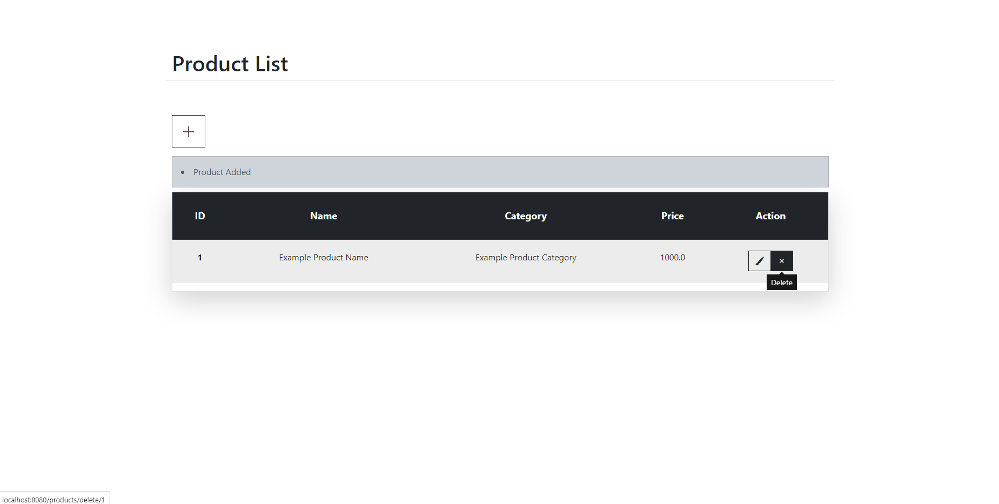

# Spring Boot CRUD Operations

Crud operations in Spring Boot

## Used Technologies
+ JDK20
+ Maven 3.9.1
+ Spring Boot 3.1.2
+ Spring Web
+ Spring Data JPA
+ Thymeleaf
+ Validation
+ H2 Database
+ Bootstrap v5.3.1
+ Bootstrap Icons v1.10.5

## For Run
 ```
 mvn clean
 mvn install
 mvn spring-boot:run

 then go to
 http://localhost:8080
 ```
## Products Page

## Add Product Page

## Edit Product Page


